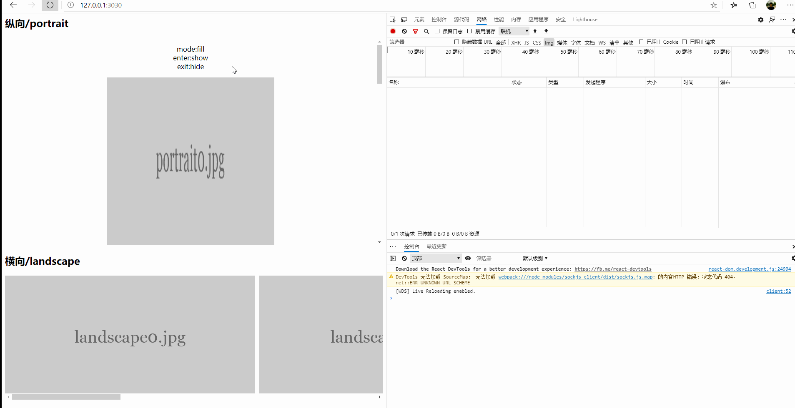

# React hook 图片懒加载组件
[English](./README.md) | 简体中文

基于React hook实现可配置动画图片懒加载组件，突破图片懒加载一闪而过的效果，自定义你想要的加载效果，也可使用第三方库，让你的图片动起来。

> 效果图

<div align="center">
  
</div>

## 用法
安装
```javascript
// npm
npm install react-animate-lazy-load-image
// yarn
yarn add react-animate-lazy-load-image
```
```javascript
import Image from "react-animate-lazy-load-image";
// ...
<Image
    enter="show" // 入场动画,内置淡入效果(show),也可为空
    exit="hide"  // 出厂动画,内置淡出效果(hide),也可为空
    style={{
        height: "400px",
        width: "600px",
    }}
    src="http://iph.href.lu/600x400?text=sample.jpg"
    placeholde="http://iph.href.lu/600x400?text=placeholde.jpg"
    title="title"
    alt="alt"
/>
// ...
```
> 与第三方动画库[animate.css](https://animate.style/)配合使用，可参考[examples](./examples)

引入css
```html
<link rel="stylesheet" href="https://cdnjs.cloudflare.com/ajax/libs/animate.css/4.0.0/animate.min.css"/>
```
直接使用class name即可，你也可以自己自定义，高度自由.
```html
<Image
    enter="animate__animated animate__zoomInDown"
    exit="animate__animated animate__zoomOutDown"
/>
```
## 配置

| 属性          | 描述            | 类型    |
| :----------: | :------------:   | :---: |
| enter        |  入场动画(内置淡入效果show)        | string  |
| exit         |  出厂动画(内置淡出效果hide)        | string  |
| src          |  图片地址        | string  |
| placeholde   |  占位图地址      | string  |
| style        |  组件样式        | object  |
| title        |  元素的额外信息   | string |
| alt          |  图像的替代文本   | string |
